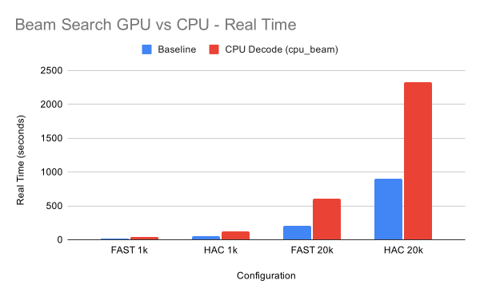
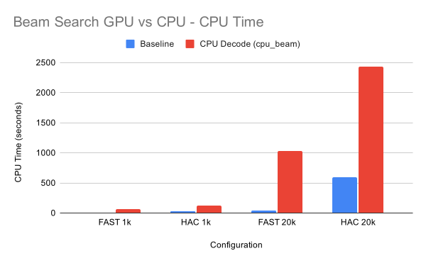
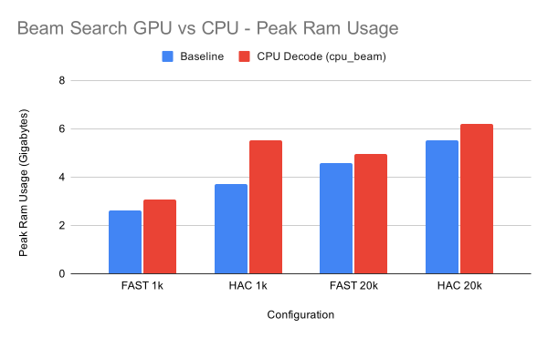

# CPU Beam Search Hybrid vs GPU Beam — Jetson Orin Timing Report

**Date:** 2026-07-22  
**Host:** Jetson Orin (`nproc=6`)  
**Codebase:** `slorado-riley-v2` develop @ Overlap v1.2 (throwaway `--cpu-beam` experiment)  
**Batch size:** `-C 128`  
**Overlap decode:** off for both modes  
**Data:** `test/PGXXXX230339/reads_{1k,20k}.blow5`  
**Models:** `dna_r10.4.1_e8.2_400bps_{fast,hac}@v5.0.0`  
**Source files:** `cpu-beam-results.txt`, `cpu-beam-timings.csv`

---

## 1. What was tested

Two decode modes with the same GPU inference path:

| Mode | Beam search | Rest of decode (bwd, fwd/post, qual, gen) |
|------|-------------|-------------------------------------------|
| **baseline** | GPU kernel | GPU |
| **cpu_beam** | CPU (`openfish_beam_search_cpu` traceback), **6 threads** (autodetect) | GPU |

The hybrid path is **not** full CPU decode. Only beam search moves to the host. That requires:

1. Sync after GPU backward scan  
2. D2H of emission scores (fp16→fp32) and `bwd_NTC`  
3. Threaded CPU beam → host `states` / `moves`  
4. H2D of `states` / `moves`  
5. Continue GPU qual / sequence generation / output D2H  

This was a throwaway experiment to quantify whether offloading beam to the Jetson CPU is worthwhile for FAST/HAC.

**Run plan:** 5 timed runs for 1k configs; 1 timed run for 20k. No warmup. Output to `/dev/null`.

---

## 2. Results

### 2.1 Mean wall time (real time)

| Config | Baseline (GPU beam) | CPU beam hybrid | Δ (s) | Slowdown | % slower |
|--------|---------------------|-----------------|-------|----------|----------|
| FAST 1k | 11.57 s | 38.71 s | +27.1 | **3.34×** | +235% |
| HAC 1k | 46.55 s | 117.36 s | +70.8 | **2.52×** | +152% |
| FAST 20k | 205.4 s | 608.2 s | +403 | **2.96×** | +196% |
| HAC 20k | 900.1 s | 2322.1 s | +1422 | **2.58×** | +158% |

1k means are over n=5 (CV% ~0.3–1.6% baseline, ~1.3–1.5% cpu_beam — stable).  
20k figures are single runs (directional only, but consistent with 1k ratios).



### 2.2 CPU time and memory (supporting)

CPU-beam runs use far more host CPU time (beam + conversion on 6 cores), e.g.:

| Config | Baseline CPU time (mean / run) | CPU-beam CPU time | Peak RAM baseline → cpu_beam |
|--------|--------------------------------|-------------------|------------------------------|
| FAST 1k | ~4.1 s | ~61 s | ~2.61 → ~3.09 GB |
| HAC 1k | ~31.8 s | ~125 s | ~3.73 → ~5.52 GB |
| FAST 20k | 41.7 s | 1030 s | 4.57 → 4.95 GB |
| HAC 20k | 589 s | 2436 s | 5.54 → 6.18 GB |

Host CPU time exceeding wall time on cpu_beam is expected with multi-threaded beam work.





---

## 3. Interpretation

### 3.1 Verdict

**CPU beam search is clearly slower on this Jetson for FAST and HAC.**  
Across the suite, the hybrid path is about **2.5–3.3×** wall-clock of the GPU-beam baseline. There is **no latency benefit** for these models on this platform.

### 3.2 Why it is slower here

1. **GPU beam is already a good fit** for FAST/HAC batch decode on Orin: highly parallel, on-device scores/bwd, no mid-pipeline PCIe round trip.  
2. **Hybrid overhead is structural**, not just “CPU is slow at arithmetic”:
   - Forced sync after bwd (breaks any hope of hiding beam behind other GPU work in the same way as a pure GPU pipeline)
   - Large D2H of scores + backward tensors every batch  
   - fp16→fp32 conversion on host  
   - H2D of states/moves before GPU qual  
3. **Six Cortex-A78AE-class cores** are not enough to outrun a CUDA beam kernel that already has the tensors resident on the GPU.  
4. **Absolute gap scales with work:** FAST sees a larger relative hit (~3×) because decode is a bigger fraction of wall time; HAC is more infer-bound so the relative slowdown is smaller (~2.5×) but still large in absolute seconds (~+24 min on HAC 20k).

### 3.3 When CPU beam might still be interesting

This result does **not** mean CPU beam is never useful. It is a poor tradeoff **for current FAST/HAC on Jetson**. It could be revisited when:

- **Heavier / higher-accuracy models** make beam (or decode generally) a larger share of time, *and*  
- The host has a **much stronger multi-core CPU** (desktop/server class), *and/or*  
- A redesign avoids naive per-batch full-score D2H (e.g. fused host decode, different score layout, or beam that does not need the full NTC tensor on host)

Even then, a fair comparison would need the same methodology (paired baseline vs hybrid, same `-C`, no overlap confounding).

---

## 4. Conclusion (for writeup)

On Jetson Orin with 6 CPU threads, moving **only** beam search to the CPU while leaving the rest of openfish decode on the GPU **increases** wall time by roughly **2.5–3.3×** versus GPU beam for FAST and HAC (1k and 20k). The hybrid path also increases host CPU use and peak RAM. **We should keep GPU beam as the default for this stack.** CPU beam remains a possible avenue for future higher-accuracy workloads on more powerful host CPUs, but it is not beneficial for the models and hardware tested here.

---

## 5. Reproducibility

```bash
# After building with the throwaway --cpu-beam flag:
python3 cpu_beam_test.py
# → cpu-beam-results.txt, cpu-beam-timings.csv
```

CLI used:

- Baseline: `--cpu-beam=no --overlap-decode=no`  
- Hybrid: `--cpu-beam=yes --overlap-decode=no` (autodetect threads → 6)
